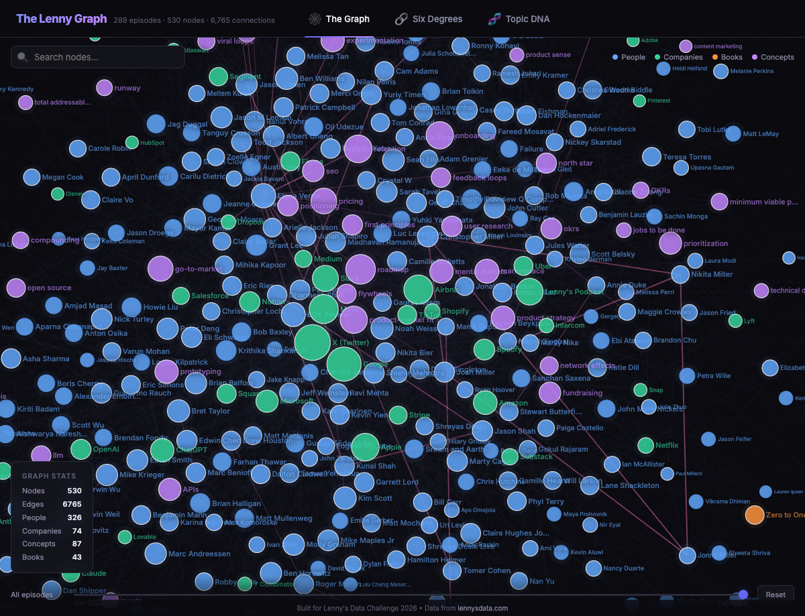
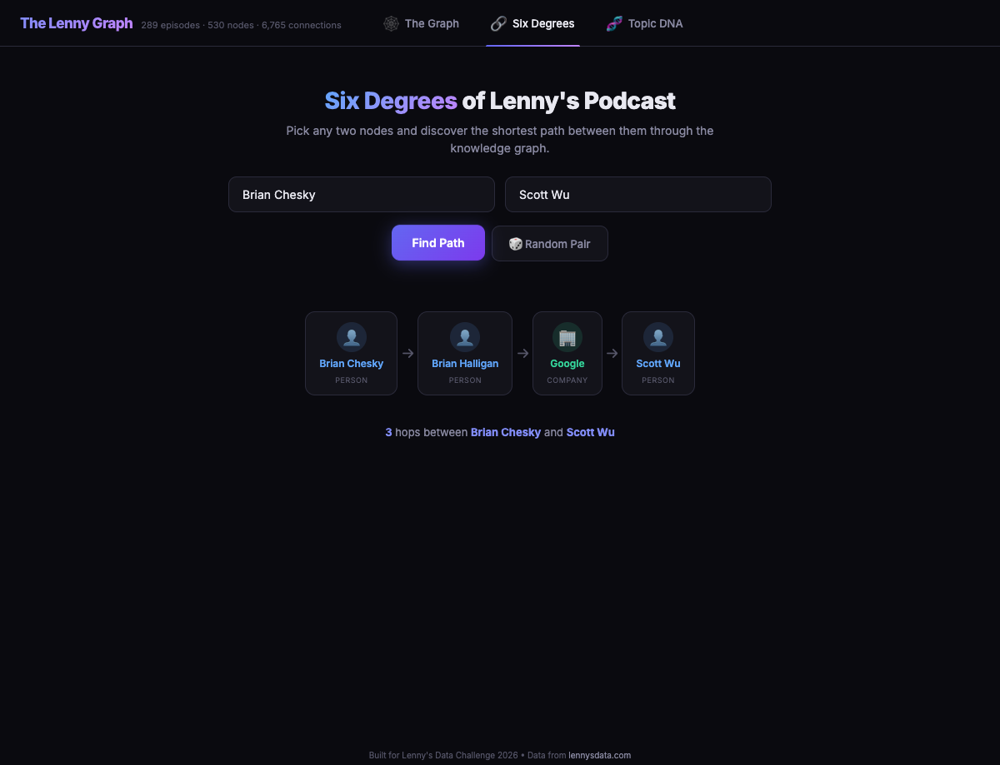
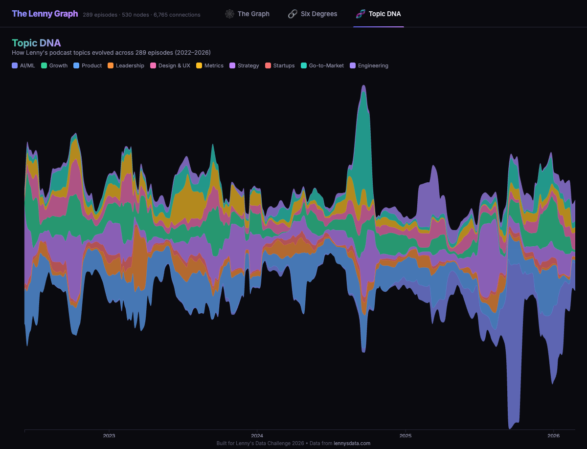

# The Lenny Graph 🔮

An interactive knowledge graph of [Lenny's Podcast](https://www.lennyspodcast.com/) — mapping people, companies, books, and concepts across 289 episodes, revealing how ideas propagate, who influences whom, and how the podcast's DNA has evolved over 4 years.

**530 nodes • 6,765 connections • 289 episodes • 349 newsletters**

## 🕸️ The Graph



An interactive force-directed network of every person, company, book, and concept in Lenny's Podcast. Zoom in to explore clusters. Click any node for details. Filter by type, search by name, slide the timeline.

- **326 people** — all podcast guests plus key figures mentioned (Steve Jobs, Brian Chesky, Sam Altman...)
- **74 companies** — Google, Airbnb, Meta, OpenAI, Stripe, and 69 more
- **87 concepts** — product-market fit, retention, vibe coding, onboarding, pricing...
- **43 books** — Zero to One, Inspired, Working Backwards, The Lean Startup...

## 🔗 Six Degrees of Lenny's Podcast



Pick any two entities and find the shortest path between them through the knowledge graph. Brian Chesky to Scott Wu? Three hops: Brian Chesky → Brian Halligan → Google → Scott Wu.

- Searchable autocomplete for all 530 nodes
- Works across entity types (people ↔ companies ↔ concepts ↔ books)
- "Random Pair" button for serendipity
- Animated path visualization with hop count

## 🧬 Topic DNA



A streamgraph showing how Lenny's podcast topics evolved from 2022 to 2026. Watch AI/ML explode in late 2024, see Growth and Product Management ebb and flow, trace the rise of Engineering as a topic.

- 10 macro topic categories extracted from concept mentions per episode
- Rolling-window smoothed for readability
- Interactive hover for episode details
- Click legend to isolate topics

## Quick Start

```bash
git clone https://github.com/nagomistudio/lenny-graph.git
cd lenny-graph
open index.html
```

That's it. Single HTML file, D3.js from CDN, no build step.

## Rebuild from Source

If you have the podcast transcripts from [lennysdata.com](https://lennysdata.com):

```bash
# Place transcripts in podcasts/, newsletters in newsletters/, and index.json in root
python3 extract.py           # Generates graph.json
python3 generate_extras.py   # Generates topic_timeline.json + paths_index.json
open index.html
```

The free starter pack has 50 episodes. Paid subscribers get the full 289 + 349 at [lennysdata.com](https://lennysdata.com).

## How It Works

**Entity Extraction** (`extract.py`) — Reads all transcripts and newsletters. Identifies people, companies, concepts, and books using guest metadata, curated seed lists, and contextual regex patterns. Builds weighted edges from co-occurrence, direct mention, and cross-episode references. Filters noise.

**Topic Classification** (`generate_extras.py`) — Maps concept entities into 10 macro categories. Counts per-episode topic vectors. Applies rolling-window smoothing. Builds adjacency list for BFS pathfinding.

**Visualization** (`index.html`) — Pure HTML + CSS + D3.js. Force-directed graph with clustering, BFS pathfinder, and stacked area streamgraph. Dark theme, smooth animations, lazy tab initialization for performance.

## Tech Stack

- **Python 3** (stdlib only) — extraction and data generation
- **D3.js v7** (CDN) — all three visualizations
- **Vanilla HTML/CSS/JS** — no frameworks, no build tools

## License

Code: MIT. Podcast content: [Lenny Rachitsky / Lenny's Newsletter](https://lennysdata.com).

---

*Built for [Lenny's Data Challenge 2026](https://www.lennysnewsletter.com/p/how-i-built-lennyrpg) • Data from [lennysdata.com](https://lennysdata.com)*
